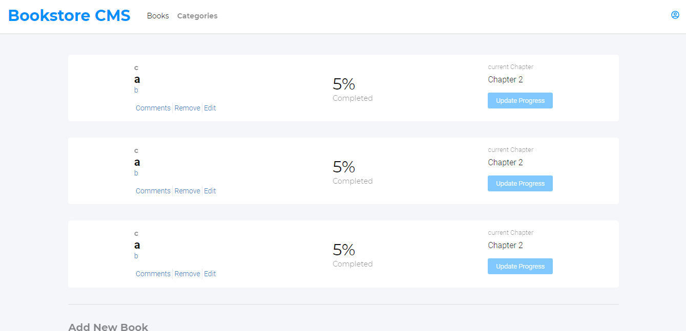

# React Book Store

> React Book Store is a project for learning core concepts of React/Redux, listing books that are fetched from an API using Redux Middleware, and also doing requests for deleting adding and updating books;

Basic UI of the project:

;

## Built With

- React
- Redux
- Js

## Live Demo

[Heroku Demo Link](https://nelsino-react-bookstore.herokuapp.com/)

## Project Description (Loom Video)

- To be Updated

## Getting Started

To get a local copy up and running follow these simple example steps.

### Prerequisites

- Git/GitHub;
- Optional ( IDE installed in your machine ) - recommended IDE: Vscode;
- Node or Yarn installed locally;

### Setup

- To clone this repo:
  - Open the Terminal(Mac/Linux) or the Cmd (Windows);
  - Navigate to where you want to paste the Repo folder;
  - Type `git clone https://github.com/nelsinofrancisco/leaderboard.git`;
  - Open the folder todo-list that was created on your IDE;

### Install

- To install all the dependencies in the package.json:
  - Open the Terminal(Mac/Linux) or the Cmd (Windows);
  - Navigate to be inside the todo-list repo folder;
  - Run npm install or npm i or yarn install;
  
### Run tests

- Linters Tests:
  - Eslint: run `npx eslint .`
  - Stylelint: run `npx stylelint "**/*.{css,scss}"`
- Run a Live Version of the Dist Folder:
  - Run `npm start or yarn start`

### Deployment

The Page is Deployed in the branch gh-pages;

## Authors

👤 **Author1**

- GitHub: [@nelsinofrancisco](https://github.com/nelsinofrancisco)
- Twitter: [@nelsino_s](https://twitter.com/nelsino_s)
- LinkedIn: [LinkedIn](https://www.linkedin.com/in/nelsinofrancisco/)

## 🤝 Contributing

Contributions, issues, and feature requests are welcome!

Feel free to check the [issues page](../../issues/).

## Show your support

Give a ⭐️ if you like this project!

## Acknowledges

## 📝 License

This project is [MIT](./MIT.md) licensed.
